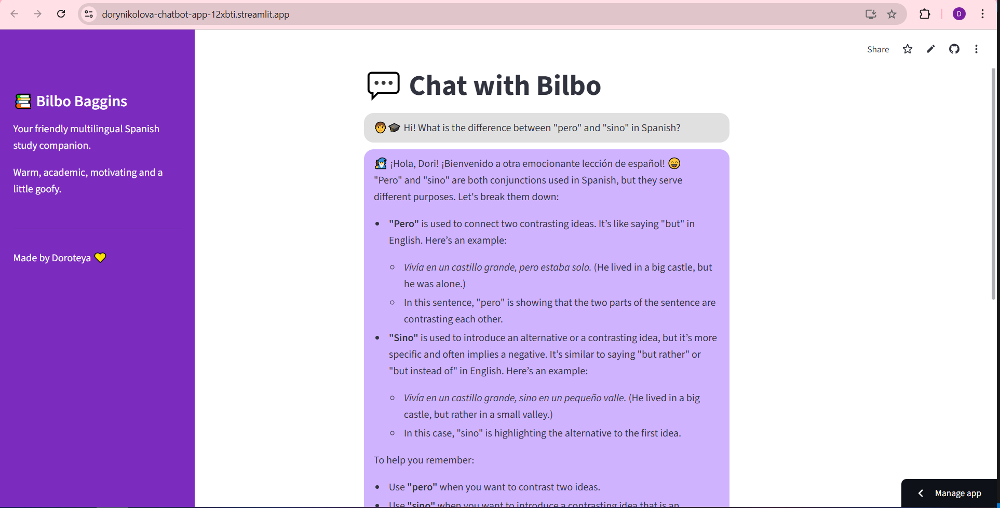

# Bilbo Baggins — Spanish Study Chatbot

Bilbo Baggins is a **friendly, warm, and slightly goofy Spanish study companion** built with **Python**, **Streamlit**, and the **Hugging Face Inference API**.  
It helps learners practice Spanish grammar, vocabulary, and exam preparation while adapting to the user’s learning profile and weak areas.

Created especially for **Dori’s A2 Spanish exam preparation**, but designed to be easily reusable for other learners.
Try the 🔗 **Live demo:** :  
https://dorynikolova-chatbot-app-12xbti.streamlit.app/

---

## Features and Technical Highlights

- Personality-driven Spanish tutor (warm, encouraging, academic)
- 🇪🇸 Grammar explanations with clear examples
- Personalized memory (level, weak areas, exam date, preferences)
- Practice exercises & exam prep tasks
- Chat interface with conversation history
- Custom Streamlit UI with styled chat bubbles
- Powered by **Qwen 2.5 7B Instruct** via Hugging Face
- Dynamic system prompt that injects user memory (level, weak areas, preferences)
- Maintains multi-turn conversation context using Streamlit session state
- Model temperature set to **0.7** to balance creativity and factual reliability

---

